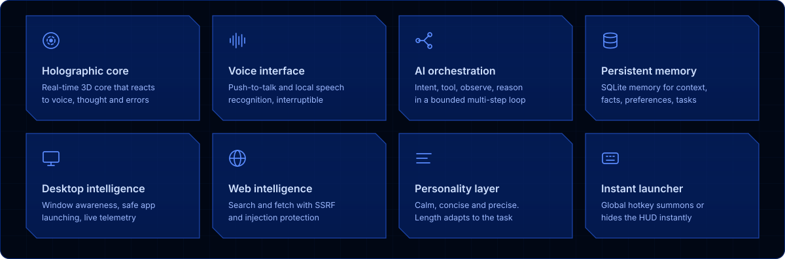
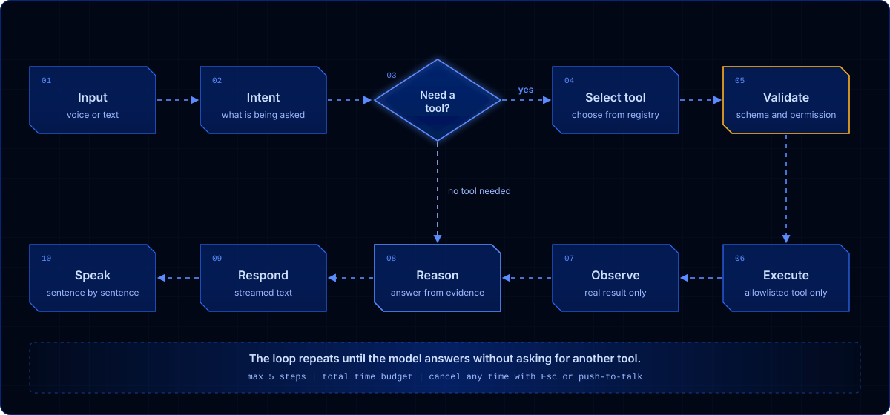
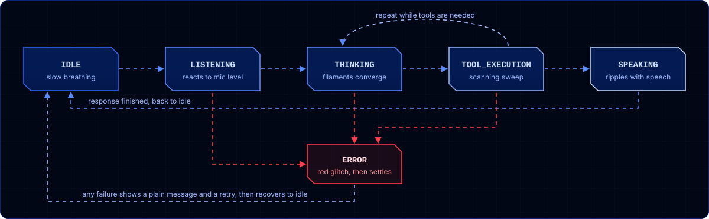
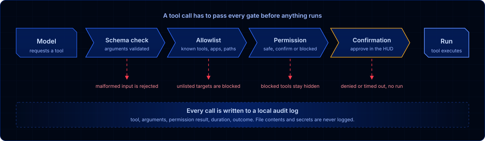
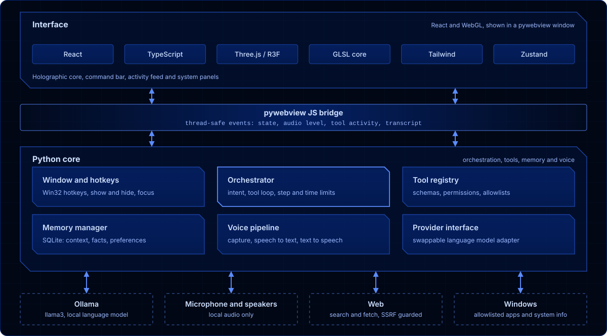

<div align="center">



<br>


**[Overview](#overview)** &nbsp;|&nbsp; **[Capabilities](#capabilities)** &nbsp;|&nbsp; **[How it thinks](#how-it-thinks)** &nbsp;|&nbsp; **[Security](#security-model)** &nbsp;|&nbsp; **[Architecture](#architecture)** &nbsp;|&nbsp; **[Get started](#getting-started)**

</div>


## Overview

Aonyx is a voice-driven AI assistant that lives on your desktop and appears the moment you call it. Press a hotkey, speak, and a holographic neural core wakes up, reacting in real time to your voice, its own thinking, and the tools it uses.

It is not a chatbot wrapped in a window. Behind the HUD sits an orchestration layer that works out what you want, decides whether a tool is needed, runs it through a strict allowlist, observes the real result, and only then responds. It does not invent tool results, and it cannot run arbitrary commands.

Everything runs locally: speech recognition, the language model, speech synthesis and memory. There is no cloud account and no telemetry. The only traffic that leaves your machine is the web lookups you allow.


## Capabilities




## How it thinks

Every request, typed or spoken, goes through the same loop. The model decides whether it needs a tool, and every tool call is validated and permission-checked before it runs. The model then answers from the real result, not from a guess. If a tool fails, Aonyx reports the actual failure.



The loop repeats until the model answers without requesting another tool, with a hard cap on steps and a total time budget.

### State machine

The HUD is driven by one state machine. The 3D core maps directly to these states: each one changes how the core moves, glows and pulses, and the core never fully stops moving.




## Security model

A language model should never be trusted with unrestricted access, so Aonyx is built around gates.



- **Explicit tool allowlist.** The model can only call registered tools. There is no shell tool, no `eval` and no "run command" capability, by design.
- **Schema validation.** Every tool call is checked against its input schema. Malformed or extra arguments are rejected.
- **Permission levels.** Tools are safe, confirm or blocked. Anything that touches your files, apps or the web asks for confirmation in the HUD first.
- **Application allowlist.** The model supplies an app key, never a path or command line. Launches use argument lists with `shell=False`.
- **SSRF protection.** Web tools refuse localhost, private and internal network addresses.
- **Prompt-injection defense.** Web pages, files and memory contents are treated as untrusted data, wrapped and flagged so instructions hidden inside them are not followed.
- **Audit trail.** Tool calls are logged with arguments, permission result, duration and outcome. File contents and secrets are not logged.
- **Privacy by default.** The microphone records only while listening, and the HUD shows whenever audio is being captured.


## Architecture

The interface and the Python core talk over the pywebview bridge. The language model sits behind a provider interface, so the orchestrator, tools and UI never depend on Ollama directly. Replacing the model means writing one adapter.



### Tech stack

| Layer | Technology |
| --- | --- |
| Desktop shell | Python, pywebview (WebView2), Win32 APIs via ctypes |
| Frontend | React, TypeScript, Vite, Tailwind CSS, Zustand |
| 3D rendering | Three.js, React Three Fiber, custom GLSL |
| Language model | Ollama (llama3), behind a provider-independent interface |
| Speech-to-text | faster-whisper, running locally |
| Text-to-speech | Windows SAPI5, with sentence-level streaming |
| Audio capture | sounddevice |
| Memory | SQLite |
| Testing | pytest |


## Getting started

### Requirements

- Windows 10 or 11 (the launcher, hotkeys and window handling use Win32)
- Python 3.10 or newer
- Node.js 18 or newer
- [Ollama](https://ollama.com) installed and running
- A working microphone and speakers

### Install

```bash
# 1. Clone
git clone https://github.com/<your-username>/aonyx.git
cd aonyx

# 2. Pull the language model
ollama pull llama3

# 3. Python environment
python -m venv venv
venv\Scripts\activate
pip install -r requirements.txt

# 4. Build the HUD
cd frontend
npm install
npm run build
cd ..

# 5. Configure
copy .env.example .env
```

### Run

```bash
pythonw aonyx_app.pyw
```

Aonyx starts in the background. Press the summon hotkey to bring up the HUD. For development, run `npm run dev` inside `frontend/`, and use `python` instead of `pythonw` to see console output.

### Controls

| Action | Default |
| --- | --- |
| Summon or hide the HUD | `Ctrl + Shift + Space` |
| Push-to-talk | `Ctrl + Alt + Space` |
| Cancel, interrupt speech, or hide | `Esc` |
| Command history | `Up` / `Down` |

Both hotkeys are configurable in `.env`. If a hotkey conflicts with another application, Aonyx shows a warning in the HUD.

### Configuration

| Setting | Purpose |
| --- | --- |
| `OLLAMA_HOST` | Ollama address, default `http://127.0.0.1:11434` |
| `OLLAMA_MODEL` | Model name, default `llama3:latest` |
| Push-to-talk key | Hotkey used for voice input |
| Input device | Microphone selection |
| Allowed apps | The application launch allowlist |
| Allowed folders | Folders the file tools may read |
| Tool limits | Maximum steps and timeouts per request |


## Extending Aonyx

Adding a tool means registering a name, description, input schema, execution function and a safety level. The registry exposes it to the model automatically, validates its arguments, and applies the confirmation rules for its permission level.

```python
@registry.tool(
    name="get_current_time",
    description="Return the current local date and time.",
    schema={"type": "object", "properties": {}, "additionalProperties": False},
    permission="safe",
    timeout=2,
)
def get_current_time(args):
    ...
```

Tools that touch the filesystem, launch programs or reach the network should use the confirm level and validate every input.

## Project structure

```
aonyx/
    app/
        orchestrator/       reasoning loop and provider interface
        tools/              tool registry and allowlisted executors
        memory/             SQLite memory manager
        voice/              capture, speech-to-text, text-to-speech
    frontend/
        src/
            components/     3D core, command bar, panels, activity feed
            store/          Zustand state machine
    tests/                  pytest suites
    aonyx_app.pyw           launcher, window manager, global hotkeys
    .env.example
```

## Testing

```bash
pytest
```

The suites cover audio chunking and gapless playback timing, web tool security (SSRF, private addresses, malformed URLs), desktop and process safety, and memory persistence across restarts.

## Known limitations

- Windows only. The launcher and hotkeys rely on Win32 APIs.
- Tool selection quality depends on the model. llama3 is workable for structured tool use, but a stronger tool-capable model will be more reliable.
- Speech synthesis uses the Windows SAPI5 voices installed on your system, so voice quality varies by machine.
- The compact orb is an opaque window. True transparency with WebGL is unreliable on WebView2.

## License

Add your license here, for example MIT.


<div align="center">

**AONYX** &nbsp;|&nbsp; built local, runs local, stays yours.

</div>
